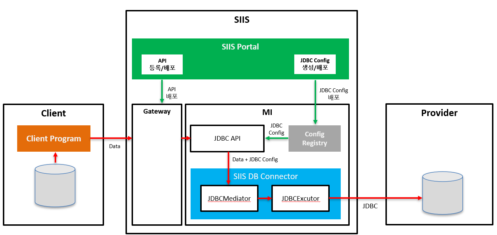

# SIIS DB Connector

설정 기반 JDBC 실행 엔진으로, JSON 입력 데이터를 DB 스키마에 매핑하고 복잡한 트랜잭션 흐름을 제어합니다.

---

## 목차

1. [개요](#1-개요)
2. [주요 특징](#2-주요-특징)
3. [핵심 개념](#3-핵심-개념)
4. [실행 흐름](#4-실행-흐름)
5. [트랜잭션 제어](#5-트랜잭션-제어)
6. [설정 가이드](#6-설정-가이드)
7. [사용 예제](#7-사용-예제)
8. [고급 기능](#8-고급-기능)
9. [에러 처리](#9-에러-처리)
10. [성능 최적화](#10-성능-최적화)
11. [제약사항](#11-제약사항)
12. [배포 가이드](#12-배포-가이드)

---

## 1. 개요

### 1.1 설계 목적

SIIS DB Connector 는 다음 요구사항을 가진 시스템을 위해 설계되었습니다:

- API/Integration Layer에서 DB 연계 로직 코드 제거
- SQL, 프로시저, 트랜잭션 흐름을 설정으로 제어
- JSON 구조와 DB 스키마 간 유연한 매핑
- 하나의 요청에서 다수의 DML + Procedure 혼합 처리
- Operation 단위 명시적 트랜잭션 분리
- Master-Detail 관계 데이터의 원자적 처리

### 1.2 아키텍처

```
Client Request (JSON)
        │
        ▼
Config Loader & Validator
        │
        ▼
JdbcExecutor
 ├─ JSON Parsing
 ├─ Record Extraction
 ├─ Operation Loop
 │   ├─ Batch Collection
 │   ├─ Commit Action Check
 │   ├─ Master-Detail Processing
 │   └─ Transaction Execution
 └─ Result Generation
        │
        ▼
Execution Result (JSON)
```

### 1.3 시스템 구성도



### 구성 요소

### 1) Client 영역
| 구성요소 | 설명 |
|---------|------|
| Client Program | 클라이언트 애플리케이션 |
| Database | 클라이언트 측 데이터베이스 |

### 2) SIIS 플랫폼

#### * SIIS Portal
| 구성요소 | 설명 |
|------|------|
| API 등록/배포 | API 서비스 등록 및 배포 관리 |
| JDBC Config 생성/배포 | API 등록정보를 기반으로 JDBC Config 자동 생성 |

#### * Gateway
- API 요청 라우팅 및 관리

#### * MI (Micro Integrator)
| 구성요소 | 설명 |
|---------|------|
| JDBC API | Client 호출 URL 제공 , SIIS DB Connector 호출 |
| Config Registry | JDBC 설정 정보 저장소 |
| SIIS DB Connector | 데이터베이스 연결 및 데이터 처리 |
| └─ JDBCMediator | MI 엔진으로부터 트리거링 되는 클래스 |
| └─ JDBCExecutor | 실제 JDBC 쿼리 실행 |

### 3) Provider 영역
| 구성요소 | 설명 |
|---------|------|
| Database | 외부 제공자의 데이터베이스 |


## 2. 주요 특징

### 2.1 Zero-Code DB Integration

**기존 방식:**

```java
public void saveUser(UserDto user) {
    userRepository.delete(user.getId());
    userRepository.merge(user);
    callProcedure();
}
```

**SIIS DB Connector:**

```yaml
operations:
  - delete_tb_user
  - insert_tb_user
  - proc_tb_user
```

### 2.2 순수 JDBC 기반

- Named Parameter Binding 자체 구현
- 트랜잭션 경계 명시적 제어

### 2.3 유연한 데이터 매핑

| JSON 필드 | SQL 파라미터 | DB 타입 |
|-----------|--------------|---------|
| id | :USER_ID | INT |
| name | :USER_NAME | VARCHAR |
| crtdt | :CREATED_DATE | DATE |
| addr | :USER_ADDR | CLOB |
| profile | :USER_PROFILE | BLOB |

---

## 3. 핵심 개념

### 3.1 Operation

하나의 SQL 또는 Stored Procedure 실행 단위입니다.

```yaml
  - operation_name: insert_tb_user
    action_type: INSERT
    data_record: data
    commit_action: COMMIT        # COMMIT / CONTINUE
    commit_scope: ALL            # ALL / ROW
  
    sql: |
      INSERT INTO TB_USER(
          USER_ID, USER_NAME, USER_NICK, USER_AGE, USER_SCORE,
          CREATED_DATE, UPDATED_TS, OPTIONAL_COL, IS_ACTIVE,
          USER_ADDR, USER_PROFILE
      ) 
      VALUES (
          :USER_ID, :USER_NAME, :USER_NICK, :USER_AGE, :USER_SCORE,
          :CREATED_DATE, :UPDATED_TS, :OPTIONAL_COL, :IS_ACTIVE,
          :USER_ADDR, :USER_PROFILE
      )
```

### 3.2 Commit Action

Operation의 트랜잭션 처리 방식을 결정합니다.

| Commit Action | 동작 |
|---------------|------|
| `CONTINUE` | 다음 Operation과 묶어서 하나의 트랜잭션으로 처리 |
| `COMMIT` | 현재까지 누적된 Operation을 즉시 커밋하고 트랜잭션 종료 |

⚠️ **중요:** Master-Detail 구조에서 Detail은 Master의 트랜잭션에 따라 Commit/Rollback됩니다.

### 3.3 Commit Scope

레코드 처리 단위를 결정합니다.

| Commit Scope | 동작 | 적용 가능 타입 |
|--------------|------|----------------|
| `ALL` | 모든 레코드를 하나의 트랜잭션으로 처리 | 모든 타입 |
| `ROW` | 각 레코드를 개별 트랜잭션으로 처리 | `INSERT`, `UPSERT`, `UPDATE`, `DELETE`만 가능 |

⚠️ **중요:**

- `ROW` scope는 `SELECT`, `PROCEDURE` 타입에서는 무시됩니다.
- Master-Detail 구조에서는 Master에서만 `ALL` 또는 `ROW` 타입이 지원되며, Detail은 Master가 Commit될 때 함께 Commit됩니다.

### 3.4 Data Record

JSON 입력에서 추출할 데이터 레코드명을 지정합니다.

**Request JSON:**

```json
{
    "operations": {
        "insert_tb_user": {
            "data": [
                {
                    "id": 1,
                    "name": "사용자_1",
                    "nick": "NICK_1",
                    "age": 21,
                    "score": 1234.56,
                    "crtdt": "2026-01-20",
                    "updts": "2026-01-20T06:45:41.529+00:00",
                    "optional": null,
                    "active": "N",
                    "addr": "서울시 강남구 테헤란로 1번지\nCLOB 테스트데이터",
                    "profile": "UFJPRklMRV9CSU5BUllfMQ=="
                }
            ]
        }
    }
}
```

**Config:**

```yaml
operation_name: insert_tb_user
data_record: data
```

---

## 4. 실행 흐름

### 4.1 전체 프로세스

```
executeJdbc()
 │
 ├─ 1. JSON 파싱 (1회)
 │
 ├─ 2. Operation 순회
 │    │
 │    ├─ Record 추출 (JsonPath 기반)
 │    │
 │    ├─ Commit Scope 판단
 │    │    ├─ ROW: ROW 단위 COMMIT
 │    │    └─ ALL: 전체 COMMIT
 │    │
 │    ├─ Commit Action 판단
 │    │    ├─ CONTINUE: Batch 누적
 │    │    └─ COMMIT: Batch 실행 & 커밋
 │    │
 │    ├─ Master-Detail 처리
 │    │    ├─ Master INSERT/UPDATE
 │    │    └─ Detail INSERT/UPDATE
 │    │
 │    └─ executeInTx()
 │         ├─ Transaction Begin
 │         ├─ SQL/Procedure 실행
 │         ├─ 성공: Commit
 │         └─ 실패: Rollback
 │
 └─ 3. JdbcExecutionResult 반환
```

---

## 5. 트랜잭션 제어

### 5.1 시나리오별 동작

#### 시나리오 1: 전체 묶음 처리

**Config:**

```yaml
operations:
  - operation_name: op1
    commit_action: CONTINUE
    
  - operation_name: op2
    commit_action: CONTINUE
    
  - operation_name: op3
    commit_action: COMMIT
```

**실행:**

```
Transaction 1 {
    [OP1 CONTINUE]
    [OP2 CONTINUE]
    [OP3 COMMIT]
}
→ COMMIT (OP1, OP2, OP3 모두 함께)
```

#### 시나리오 2: 중간 커밋

**Config:**

```yaml
operations:
  - operation_name: delete_old
    commit_action: CONTINUE
    
  - operation_name: insert_new
    commit_action: COMMIT
    
  - operation_name: call_proc
    commit_action: COMMIT
```

**실행:**

```
Transaction 1 {
    [DELETE CONTINUE]
    [INSERT COMMIT]
}
→ COMMIT 1 (DELETE + INSERT)

Transaction 2 {
    [PROCEDURE COMMIT]
}
→ COMMIT 2 (PROCEDURE만)
```

#### 시나리오 3: 개별 트랜잭션

**Config:**

```yaml
operations:
  - operation_name: op1
    commit_action: COMMIT
    
  - operation_name: op2
    commit_action: COMMIT
```

**실행:**

```
Transaction 1 {
    [OP1 COMMIT]
}
→ COMMIT 1

Transaction 2 {
    [OP2 COMMIT]
}
→ COMMIT 2
```

### 5.2 실전 패턴: DELETE → INSERT → PROCEDURE

**Config:**

```yaml
operations:
  - operation_name: delete_tb_user
    action_type: DELETE
    commit_action: CONTINUE
    
  - operation_name: insert_tb_user
    action_type: INSERT
    commit_action: COMMIT
    
  - operation_name: proc_tb_user
    action_type: PROCEDURE
    commit_action: COMMIT
```

**실행:**

```
Transaction 1 {
    [DELETE CONTINUE]  ─┐
    [INSERT COMMIT]     ├─ 원자적 데이터 갱신
}                       │
→ COMMIT 1             ─┘

Transaction 2 {
    [PROCEDURE COMMIT]  ← 동기화 처리
}
→ COMMIT 2
```

**장점:**

- DELETE + INSERT가 원자적으로 처리됨
- PROCEDURE 실패 시 DELETE + INSERT는 이미 커밋된 상태 유지
- 명확한 트랜잭션 경계

---

## 6. 설정 가이드

### 6.1 전역 설정

```yaml
api_name: DeleteInsertProcedure

target_system_key: SST0001DEF
target_system_name: MYTEST
target_jndi_name: jdbc/SST0001DEF

batch_size: 100
max_row_limit: 100000

stop_on_operation_error: true
stop_on_row_error: true

data_record_path: /operations
data_dump: false

connection_retry_count: 0            # getConnection() 실패 시 추가 시도 횟수 (0=재시도 없음)
connection_retry_interval_ms: 500    # 재시도 사이 고정 대기 시간
connection_read_timeout_ms: 0        # 커넥션 획득 후 SQL 실행에 적용할 응답 대기 상한 (0=제한 없음)

date_formats:
  - yyyy-MM-dd
  - yyyyMMdd

timestamp_formats:
  - yyyy-MM-dd'T'HH:mm:ss.SSSXXX   # ISO-8601 (timezone 포함, TZ-aware TIMESTAMP 전용)

timestamp_ntz_formats:
  - yyyy-MM-dd'T'HH:mm:ss.SSS      # timezone 없는 TIMESTAMP 전용
  - yyyy-MM-dd HH:mm:ss.SSS

timestamp_zone_strategy: SYSTEM    # UTC / SYSTEM / FIXED
# fixed_zone_id: Asia/Seoul        # timestamp_zone_strategy: FIXED 일 때만 사용

operations:
  # Operation 목록
```

### 6.2 설정 항목 상세

| 항목 | 설명 | 필수 여부 | 기본값 |
|------|------|-----------|--------|
| `api_name` | API 식별자 | **필수** | - |
| `target_system_key` | 대상 시스템 키 | **필수** | - |
| `target_system_name` | 대상 시스템 이름 | 선택 | - |
| `target_jndi_name` | JNDI 이름 | **필수** | - |
| `batch_size` | Batch 처리 크기 | 선택 | `100` |
| `max_row_limit` | SELECT 최대 조회 건수 (전역) — Operation의 `max_row_limit`로 개별 override 가능 | 선택 | `100000` |
| `data_record_path` | JSON 루트 경로 (고정값, 실질적으로 변경 불가 — Operation의 `data_record_path`로 개별 override 가능) | 선택 | `/operations` |
| `data_dump` | 요청/응답 JSON, SQL 바인딩 값을 DEBUG 로그로 덤프할지 여부 | 선택 | `false` |
| `stop_on_operation_error` | Operation 실패 시 전체 중단 여부 | 선택 | `true` |
| `stop_on_row_error` | Row 실패 시 Operation 중단 여부 (ROW scope) | 선택 | `true` |
| `connection_retry_count` | `getConnection()` 실패 시 추가로 시도할 횟수 (아래 10.2절 참고) | 선택 | `0` |
| `connection_retry_interval_ms` | 커넥션 획득 재시도마다 적용되는 고정 대기 시간(ms) | 선택 | `500` |
| `connection_read_timeout_ms` | 커넥션 획득 후 `Connection.setNetworkTimeout()`으로 적용할 값(ms) — 획득 이후 실행하는 SQL의 응답 대기만 제한 | 선택 | `0`(제한 없음) |
| `date_formats` | 날짜 파싱 포맷 목록 | 선택 | 기본 포맷 제공 |
| `timestamp_formats` | timezone 포함(TZ-aware) TIMESTAMP 파싱 포맷 목록 | 선택 | `yyyy-MM-dd'T'HH:mm:ss.SSSXXX` |
| `timestamp_ntz_formats` | timezone 없는(NTZ) TIMESTAMP 파싱 포맷 목록 — 미설정 시 `timestamp_formats`로 폴백 | 선택 | 기본 포맷 제공 |
| `timestamp_zone_strategy` | NTZ 값을 타임존 있는 값으로 변환할 때 사용할 전략: `UTC`(UTC 고정) / `SYSTEM`(서버 시스템 타임존) / `FIXED`(`fixed_zone_id` 지정값) | 선택 | `SYSTEM` |
| `fixed_zone_id` | `timestamp_zone_strategy: FIXED`일 때 사용할 Zone ID (예: `Asia/Seoul`) | 조건부 | `UTC` |
| `operations` | Operation 목록 | **필수** | - |

⚠️ **`target_jndi_name`은 실제로는 필수입니다** — 설정 로더가 값이 없으면 검증 단계에서 바로 실패합니다.

#### date_formats 기본값

입력 데이터의 포맷이 다양하더라도 설정된 포맷 리스트를 순차적으로 시도하여 시스템 중단 없이 안정적으로 데이터를 파싱합니다. SELECT의 경우 제일 첫 번째로 정의된 포맷으로 생성됩니다.

```yaml
date_formats:
  - yyyy-MM-dd
  - yyyyMMdd
  - yyyy/MM/dd
```

#### timestamp_formats / timestamp_ntz_formats 기본값

`TIMESTAMP WITH TIME ZONE`(오프셋 포함)과 `TIMESTAMP`(오프셋 없음, NTZ)를 서로 다른 포맷 목록으로 파싱합니다.

```yaml
timestamp_formats:       # TZ-aware 전용
  - yyyy-MM-dd'T'HH:mm:ss.SSSXXX   # ISO-8601 (timezone)

timestamp_ntz_formats:   # NTZ(timezone 없음) 전용
  - yyyy-MM-dd'T'HH:mm:ss.SSS
  - yyyy-MM-dd HH:mm:ss.SSS
```

`timestamp_ntz_formats`를 설정하지 않으면 `timestamp_formats`의 포맷으로 폴백합니다(하위 호환). NTZ 값을 실제 타임존이 있는 값으로 환산할 때는 `timestamp_zone_strategy`(`UTC`/`SYSTEM`/`FIXED`)를 따릅니다 — 기본값은 `SYSTEM`(서버가 실행 중인 JVM의 시스템 타임존)입니다.

### 6.3 Operation 설정

```yaml
operations:
  - operation_name: delete_tb_user
    action_type: DELETE
    data_record: data
    commit_action: CONTINUE        # COMMIT / CONTINUE
    commit_scope: ALL              # ALL / ROW (INSERT, UPSERT, UPDATE, DELETE만 ROW 허용)
    sql: |
      DELETE FROM TB_USER WHERE USER_ID = :USER_ID

    fields:
      - { data_field: id, param: USER_ID, type: INT }

  - operation_name: insert_tb_user
    action_type: INSERT
    data_record: data
    commit_action: COMMIT
    commit_scope: ALL
  
    sql: |
      INSERT INTO TB_USER(
          USER_ID, USER_NAME, USER_NICK, USER_AGE, USER_SCORE,
          CREATED_DATE, UPDATED_TS, OPTIONAL_COL, IS_ACTIVE,
          USER_ADDR, USER_PROFILE
      ) 
      VALUES (
          :USER_ID, :USER_NAME, :USER_NICK, :USER_AGE, :USER_SCORE,
          :CREATED_DATE, :UPDATED_TS, :OPTIONAL_COL, :IS_ACTIVE,
          :USER_ADDR, :USER_PROFILE
      )

    fields:
      - { data_field: id       , param: USER_ID      , type: INT }
      - { data_field: name     , param: USER_NAME    , type: STRING }
      - { data_field: nick     , param: USER_NICK    , type: STRING }
      - { data_field: age      , param: USER_AGE     , type: INT }
      - { data_field: score    , param: USER_SCORE   , type: DECIMAL }
      - { data_field: crtdt    , param: CREATED_DATE , type: DATE }
      - { data_field: updts    , param: UPDATED_TS   , type: TIMESTAMP }
      - { data_field: optional , param: OPTIONAL_COL , type: STRING }
      - { data_field: active   , param: IS_ACTIVE    , type: STRING }
      - { data_field: addr     , param: USER_ADDR    , type: CLOB }
      - { data_field: profile  , param: USER_PROFILE , type: BLOB }

```

#### Operation 설정 항목

| 항목 | 설명 | 필수 여부 | 기본값 | 비고 |
|------|------|-----------|--------|------|
| `operation_name` | Operation 식별자 | **필수** | - | 고유해야 함 |
| `action_type` | Operation 타입 | **필수** | - | `DELETE`, `INSERT`, `UPDATE`, `UPSERT`, `SELECT`, `PROCEDURE` |
| `data_record` | JSON 레코드 키 | **필수** | - | JSON의 최상위 키와 일치 |
| `commit_action` | 트랜잭션 제어 | 선택 | `CONTINUE` | `COMMIT`, `CONTINUE` |
| `commit_scope` | 레코드 처리 단위 | 선택 | `ALL` | `ALL`, `ROW` (`INSERT`/`UPSERT`/`UPDATE`/`DELETE`만 `ROW` 허용, `SELECT`/`PROCEDURE`는 무시) |
| `sql` | SQL 문 | 조건부 필수 | - | PROCEDURE 제외 필수 |
| `fields` | 필드 매핑 목록 | **필수** | - | - |
| `has_detail` | Master-Detail 여부 | 선택 | `false` | Master Operation인 경우 `true` |
| `detail_operations` | Detail Operation 목록 | 조건부 필수 | - | `has_detail=true`인 경우 필수 |
| `data_record_path` | 이 Operation만 전역 `data_record_path`를 덮어씀 | 선택 | 전역값 상속 | 이 Operation을 쓰면 요청 JSON에 `operations` 키가 없어도 됨(§9.2 참고) |
| `max_row_limit` | 이 Operation만 전역 `max_row_limit`을 덮어씀 (SELECT) | 선택 | 전역값 상속 | - |
| `execute_if_no_data` | 요청 JSON에 이 Operation 키 자체가 없어도 강제 실행할지 여부 | 선택 | `false` | `data_record: null`(키는 있고 값이 null)과는 다른 케이스 — "키 자체가 없음"을 다룸 |
| `bulk` | 대량 처리 시 청크 단위로 커밋하는 Bulk 모드 사용 여부 | 선택 | `false` | `INSERT`/`UPDATE`/`DELETE`/`UPSERT`만 가능, Collection(IN절) 파라미터 미지원 — §8.2 참고 |
| `chunk_commit_size` | `bulk: true`일 때 한 번에 커밋할 행 수 | 선택 | `1000` | `bulk: true`일 때만 의미 있음 |
| `fetch_size` | SELECT 결과를 스트리밍으로 생성할 때의 fetch 크기 — 설정 시 결과를 메모리에 모두 적재하지 않고 스트리밍 처리 | 선택 | - (미설정 시 기존 방식) | `SELECT`에서만 의미 있음 — §8.3 참고 |

### 6.4 Field 설정

```yaml
fields:
  - { data_field: id, param: USER_ID, type: INT, isWhereParam: true }
```

#### Field 설정 항목

| 항목 | 설명 | 필수 여부 |
|------|------|-----------|
| `data_field` | JSON 필드명 | **필수** |
| `param` | SQL 파라미터명 (`:param` 형식으로 사용) | **필수** |
| `type` | 데이터 타입 | **필수** |
| `direction` | IN/OUT/INOUT ( SELECT는 OUT이 디폴트 , 그외는 IN이 디폴트 설정임) | 선택 |

### 6.5 지원 데이터 타입

| 타입 | SQL Type | Java Type | 설명 |
|------|----------|-----------|------|
| `INT` | INTEGER | Integer | 정수 |
| `LONG` | BIGINT | Long | Long 정수 |
| `DOUBLE` | DOUBLE | Double | 실수 |
| `FLOAT` | FLOAT | Float | 단정도 실수 |
| `STRING` | VARCHAR | String | 문자열 |
| `CHAR` | CHAR | String | 고정길이 문자열 |
| `DATE` | DATE | java.sql.Date | 날짜 |
| `TIMESTAMP` | TIMESTAMP | java.sql.Timestamp | 날짜+시간 (timezone 없음, NTZ) — `timestamp_ntz_formats`/`timestamp_zone_strategy` 적용 |
| `TIMESTAMP_WITH_TIMEZONE` | TIMESTAMP WITH TIME ZONE | OffsetDateTime | 날짜+시간+timezone — Oracle/MSSQL/PostgreSQL은 오프셋을 그대로 보존, MySQL/MariaDB는 해당 SQL 타입이 없어 UTC로 변환되어 저장됨 |
| `DECIMAL` | DECIMAL | BigDecimal | 고정소수점 |
| `BOOLEAN` | BOOLEAN | Boolean | 논리값 |
| `CLOB` | CLOB | String | 대용량 텍스트 |
| `BLOB` | BLOB | byte[] | 바이너리 (Base64 인코딩) |

### 6.6 지원 데이터베이스

| DB | 비고 |
|----|------|
| Oracle | 기준 구현체. `DUAL` 테이블 사용 |
| Tibero | Oracle 고호환 — Oracle과 동일한 전략(OracleStrategy) 재사용 |
| MSSQL (SQL Server) | `DATETIME`은 약 3.33ms 단위로 반올림됨 — 밀리초 정밀도가 필요하면 `DATETIME2` 컬럼 사용 권장 |
| PostgreSQL | BLOB/CLOB은 `getBlob()`/`getClob()`이 아니라 `getBytes()`/`getString()`으로 처리 (pgjdbc의 OID 기반 `getBlob()`은 `bytea`/`text` 컬럼에서 예외 발생) |
| MySQL | `TIMESTAMP WITH TIME ZONE` SQL 타입 자체가 없어 `TIMESTAMP_WITH_TIMEZONE` 값은 UTC로 변환되어 저장됨 |
| MariaDB | MySQL과 동일한 제약 적용 |

### 6.7 응답 HTTP 헤더

모든 응답에 `CUSTOM-LOG-recordcount` 헤더가 추가되며, "대표 오퍼레이션"의 처리 건수를 담습니다.

**대표 오퍼레이션 선정 규칙:**

1. 최상위 Operation 중 `DELETE`, `PROCEDURE`가 아닌 첫 번째 Operation을 대표로 선정합니다.
2. 최상위 Operation이 전부 `DELETE`/`PROCEDURE`뿐이고 그 개수가 2개 이상이면, 대표를 정할 수 없어 헤더 값은 빈 문자열(`""`)입니다.
3. 최상위 Operation이 단 1개뿐이고 그게 `DELETE`/`PROCEDURE`라면, 그 Operation을 대표로 삼되 전달된 데이터가 없으면(`requestRecordCount <= 0`) 빈 문자열(`""`)입니다.

**대표 오퍼레이션의 값 산정:**

| 대표 Operation 상태/타입 | 헤더 값 |
|---|---|
| 대표가 실패/스킵됐거나 실행 결과를 찾을 수 없음 | `"0"` |
| `SELECT` | 응답 건수 (`responseRecordCount`) |
| `INSERT` / `UPDATE` / `UPSERT` | 요청 건수 (`requestRecordCount`) |
| 데이터가 있는 단일 `DELETE`/`PROCEDURE` | 요청 건수 (`requestRecordCount`) |

---

## 7. 사용 예제

### 7.1 예제 1: DELETE → INSERT → PROCEDURE

#### Config

```yaml
api_name: DeleteInsertProcedure

target_system_key: SST0001DEF
target_system_name: MYTEST
target_jndi_name: jdbc/SST0001DEF

batch_size: 100

stop_on_operation_error: true
stop_on_row_error: true

data_record_path: /operations

date_formats:
  - yyyy-MM-dd
  - yyyyMMdd

timestamp_formats:
  - yyyy-MM-dd'T'HH:mm:ss.SSSXXX
  - yyyy-MM-dd'T'HH:mm:ss.SSS
  - yyyy-MM-dd'T'HH:mm:ss
  - yyyy-MM-dd HH:mm:ss
  
operations:
  - operation_name: delete_tb_user
    action_type: DELETE
    data_record: data
    commit_action: CONTINUE
    commit_scope: ALL
    sql: |
      DELETE FROM TB_USER

  - operation_name: insert_tb_user
    action_type: INSERT
    data_record: data
    commit_action: COMMIT
    commit_scope: ALL
  
    sql: |
      INSERT INTO TB_USER(
          USER_ID, USER_NAME, USER_NICK, USER_AGE, USER_SCORE,
          CREATED_DATE, UPDATED_TS, OPTIONAL_COL, IS_ACTIVE,
          USER_ADDR, USER_PROFILE
      ) 
      VALUES (
          :USER_ID, :USER_NAME, :USER_NICK, :USER_AGE, :USER_SCORE,
          :CREATED_DATE, :UPDATED_TS, :OPTIONAL_COL, :IS_ACTIVE,
          :USER_ADDR, :USER_PROFILE
      )

    fields:
      - { data_field: id       , param: USER_ID      , type: INT }
      - { data_field: name     , param: USER_NAME    , type: STRING }
      - { data_field: nick     , param: USER_NICK    , type: STRING }
      - { data_field: age      , param: USER_AGE     , type: INT }
      - { data_field: score    , param: USER_SCORE   , type: DECIMAL }
      - { data_field: crtdt    , param: CREATED_DATE , type: DATE }
      - { data_field: updts    , param: UPDATED_TS   , type: TIMESTAMP }
      - { data_field: optional , param: OPTIONAL_COL , type: STRING }
      - { data_field: active   , param: IS_ACTIVE    , type: STRING }
      - { data_field: addr     , param: USER_ADDR    , type: CLOB }
      - { data_field: profile  , param: USER_PROFILE , type: BLOB }

  - operation_name: proc_tb_user
    action_type: PROCEDURE
    data_record: data
    commit_action: COMMIT
    commit_scope: ALL
    sql: PROC_COPY_TB_USER()
```

#### Request

```json
{
    "operations": {
        "delete_tb_user": null,
        "insert_tb_user": {
            "data": [
                {
                    "id": 1,
                    "name": "사용자_1",
                    "nick": "NICK_1",
                    "age": 21,
                    "score": 1234.56,
                    "crtdt": "2026-01-20",
                    "updts": "2026-01-20T06:45:41.529+00:00",
                    "optional": null,
                    "active": "N",
                    "addr": "서울시 강남구 테헤란로 1번지\nCLOB 테스트 데이터",
                    "profile": "UFJPRklMRV9CSU5BUllfMQ=="
                },
                {
                    "id": 2,
                    "name": "사용자_2",
                    "nick": "NICK_2",
                    "age": 22,
                    "score": 1234.56,
                    "crtdt": "2026-01-20",
                    "updts": "2026-01-20T06:45:41.529+00:00",
                    "optional": null,
                    "active": "Y",
                    "addr": "서울시 강남구 테헤란로 2번지\nCLOB 테스트 데이터",
                    "profile": "UFJPRklMRV9CSU5BUllfMg=="
                }
            ]
        },
        "proc_tb_user": null
    }
}
```

**JSON 구조 규칙:**

- `data_record_path: /operations`
- `operation_name`
- `data_record: data`

위 설정 조합에 따라 처리할 레코드를 참조합니다.

- Value는 배열 또는 `null`
  - 배열: 레코드 단위 반복 처리
  - `null`: 파라미터 없는 Operation (전체 DELETE, Procedure 등)

#### Response

```json
{
    "apiName": "DeleteInsertProcedure",
    "targetSystemName": "MYTEST",
    "targetSystemKey": "SST0001DEF",
    "global_transaction_id": "e8638e22-9122-4afb-8429-2fb4c4078e5f",
    "startTime": "2026-02-04T22:19:37.863",
    "endTime": "2026-02-04T22:19:37.916",
    "elapsedMs": 53,
    "success": false,
    "code": "E206",
    "message": "Partially committed. (Success: 2, Total: 3)",
    "errorSummary": "[proc_tb_user] (SqlState:23000) ORA-00001: 무결성 제약 조건(C##SIIS.PK_TB_USER2)에 위배됩니다\nORA-06512: \"C##SIIS.PROC_COPY_TB_USER\",  4행\nORA-06512:  1행",
    "operations": {
        "delete_tb_user": {
            "order": 1,
            "success": true,
            "skipped": false,
            "committed": true,
            "elapsedMs": 1,
            "requestRecordCount": 0,
            "responseRecordCount": 0,
            "successCount": 0,
            "failCount": 0,
            "affectedRows": 10,
            "errorMessage": null,
            "errorCode": null,
            "errorType": null,
            "errorDetail": null,
            "rowErrors": null,
            "actionType": "DELETE",
            "data": null
        },
        "insert_tb_user": {
            "order": 2,
            "success": true,
            "skipped": false,
            "committed": true,
            "elapsedMs": 16,
            "requestRecordCount": 10,
            "responseRecordCount": 0,
            "successCount": 10,
            "failCount": 0,
            "affectedRows": 10,
            "errorMessage": null,
            "errorCode": null,
            "errorType": null,
            "errorDetail": null,
            "rowErrors": null,
            "actionType": "INSERT",
            "data": null
        },
        "proc_tb_user": {
            "order": 3,
            "success": false,
            "skipped": false,
            "committed": false,
            "elapsedMs": 4,
            "requestRecordCount": 0,
            "responseRecordCount": 0,
            "successCount": 0,
            "failCount": 0,
            "affectedRows": 0,
            "errorMessage": "Duplicate: Unique constraint violated",
            "errorCode": "1",
            "errorType": "DB_ERROR",
            "errorDetail": "(SqlState:23000) ORA-00001: 무결성 제약 조건(C##SIIS.PK_TB_USER2)에 위배됩니다\nORA-06512: \"C##SIIS.PROC_COPY_TB_USER\",  4행\nORA-06512:  1행\n",
            "rowErrors": null,
            "actionType": "PROCEDURE",
            "data": null
        }
    }
}
```

---

### 7.2 예제 1: SELECT

#### Config

```yaml
api_name: SelectParam 

target_system_key: SST0001DEF
target_system_name: MYTEST
target_jndi_name: jdbc/SST0001DEF


stop_on_operation_error: true
stop_on_row_error: true

max_row_limit: 100000

data_record_path: /operations

date_formats:
  - yyyy-MM-dd
  - yyyyMMdd

timestamp_formats:
  - yyyy-MM-dd'T'HH:mm:ss.SSSXXX   # ISO-8601 (timezone)  
  - yyyy-MM-dd'T'HH:mm:ss.SSS
  - yyyy-MM-dd'T'HH:mm:ss
  - yyyy-MM-dd HH:mm:ss

  
operations:
  - operation_name: select_tb_user
      
    action_type: SELECT
    data_record: data
    commit_action: COMMIT # COMMIT/CONTINUE
    commit_scope: ALL # ALL 수신된 전체 row 일괄 COMMIT / ROW 는 레코드별 COMMIT  ( INSERT, UPSERT, UPDATE, DELETE만 ROW 허용 , 그외에는 무시 )
    
    sql: |
      SELECT USER_ID,
             USER_NAME,
             USER_NICK,
             USER_AGE,
             USER_SCORE,
             CREATED_DATE,
             UPDATED_TS,
             OPTIONAL_COL,
             IS_ACTIVE,
             USER_ADDR,
             USER_PROFILE
      FROM TB_USER WHERE USER_ID = :USER_ID
             
    fields:
      - { data_field: id,       param: USER_ID,       type: INT, direction: INOUT }
      - { data_field: name,     param: USER_NAME,     type: STRING }
      - { data_field: nick,     param: USER_NICK,     type: CHAR }
      - { data_field: age,      param: USER_AGE,      type: INT }
      - { data_field: score,    param: USER_SCORE,    type: DECIMAL }
      - { data_field: crtdt,    param: CREATED_DATE,  type: DATE }
      - { data_field: updts,    param: UPDATED_TS,    type: TIMESTAMP }
      - { data_field: optional, param: OPTIONAL_COL,  type: STRING }
      - { data_field: active,   param: IS_ACTIVE,     type: STRING }
      - { data_field: addr,     param: USER_ADDR,     type: CLOB }
      - { data_field: profile,  param: USER_PROFILE,  type: BLOB }
```

#### Request

```json
{
    "operations": {
        "select_tb_user": {
            "data": [
                {
                    "id": "1"
                }
            ]
        }
    }
}
```

#### Response

```json
{
    "apiName": "SelectParam",
    "targetSystemName": "MYTEST",
    "targetSystemKey": "SST0001DEF",
    "global_transaction_id": "e8638e22-9122-4afb-8429-2fb4c4078e5f",
    "startTime": "2026-02-04T22:25:04.127",
    "endTime": "2026-02-04T22:25:04.139",
    "elapsedMs": 12,
    "success": true,
    "code": "S000",
    "message": "Request processed successfully.",
    "operations": {
        "select_tb_user": {
            "order": 1,
            "success": true,
            "skipped": false,
            "committed": true,
            "elapsedMs": 5,
            "requestRecordCount": 1,
            "responseRecordCount": 0,
            "successCount": 1,
            "failCount": 0,
            "affectedRows": 0,
            "errorMessage": null,
            "errorCode": null,
            "errorType": null,
            "errorDetail": null,
            "rowErrors": null,
            "actionType": "SELECT",
            "data": [
                {
                    "id": "1",
                    "name": "사용자_1",
                    "nick": "NICK_1",
                    "age": 21,
                    "score": 1234.56,
                    "crtdt": "2026-01-20",
                    "updts": "2026-01-20T15:45:41.529+09:00",
                    "optional": null,
                    "active": "N",
                    "addr": "서울시 강남구 테헤란로 1번지\nCLOB 테스트 데이터",
                    "profile": "UFJPRklMRV9CSU5BUllfMQ=="
                }
            ]
        }
    }
}
```

---
### 7.3 예제 3: Master-Detail 처리

Master-Detail 관계의 데이터를 원자적으로 처리합니다.

#### Config

```yaml
api_name: InsertMasterDetail 

target_system_key: SST0001DEF
target_system_name: MYTEST
target_jndi_name: jdbc/SST0001DEF

batch_size: 100

stop_on_operation_error: true
stop_on_row_error: true

data_record_path: /operations

date_formats:
  - yyyy-MM-dd
  - yyyyMMdd

timestamp_formats:
  - yyyy-MM-dd'T'HH:mm:ss.SSSXXX   # ISO-8601 (timezone)
  - yyyy-MM-dd'T'HH:mm:ss.SSS
  - yyyy-MM-dd'T'HH:mm:ss
  - yyyy-MM-dd HH:mm:ss
  - yyyy-MM-dd
  
operations:
  - operation_name: delete_tb_user_histroy
      
    action_type: DELETE
    data_record: data
    commit_action: CONTINUE # COMMIT/CONTINUE
    commit_scope: ALL # ALL 수신된 전체 row 일괄 COMMIT / ROW 는 레코드별 COMMIT  ( INSERT, UPSERT, UPDATE, DELETE만 ROW 허용 , 그외에는 무시 )
    
    sql: |
      DELETE FROM TB_USER_HIST
      
  - operation_name: delete_tb_user_master
      
    action_type: DELETE
    data_record: delete_tb_user_master
    commit_action: CONTINUE # COMMIT/CONTINUE
    commit_scope: ALL # ALL 수신된 전체 row 일괄 COMMIT / ROW 는 레코드별 COMMIT
    
    sql: |
      DELETE FROM TB_USER
      
  - operation_name: insert_tb_user_master
    action_type: INSERT
    data_record: data
    has_detail: true
    
    commit_action: COMMIT  # Enum: COMMIT or CONTINUE
    commit_scope: ALL        # Enum: ALL or ROW
    
    sql: |
      INSERT INTO TB_USER(
          USER_ID, USER_NAME, USER_NICK, USER_AGE, USER_SCORE,
          CREATED_DATE, UPDATED_TS, OPTIONAL_COL, IS_ACTIVE,
          USER_ADDR, USER_PROFILE
      ) 
      VALUES (
          :USER_ID, :USER_NAME, :USER_NICK, :USER_AGE, :USER_SCORE,
          :CREATED_DATE, :UPDATED_TS, :OPTIONAL_COL, :IS_ACTIVE,
          :USER_ADDR, :USER_PROFILE
      )

    fields:
      - { data_field: id       , param: USER_ID      , type: STRING }
      - { data_field: name     , param: USER_NAME    , type: STRING }
      - { data_field: nick     , param: USER_NICK    , type: STRING }
      - { data_field: age      , param: USER_AGE     , type: INT }
      - { data_field: score    , param: USER_SCORE   , type: DECIMAL }
      - { data_field: crtdt    , param: CREATED_DATE , type: DATE }
      - { data_field: updts    , param: UPDATED_TS   , type: TIMESTAMP }
      - { data_field: optional , param: OPTIONAL_COL , type: STRING }
      - { data_field: active   , param: IS_ACTIVE    , type: STRING }
      - { data_field: addr     , param: USER_ADDR    , type: CLOB }
      - { data_field: profile  , param: USER_PROFILE , type: BLOB }
    
    # - data_field: details (Note: processed by detail_operations)

    detail_operations:
      - operation_name: insert_tb_user_histroy
        action_type: INSERT
        data_record: tb_user_histroy
        
        commit_action: COMMIT
        commit_scope: ALL
        
        sql: |
          INSERT INTO TB_USER_HIST (HIST_ID,USER_ID,CHANGE_TYPE, CHANGE_DESC, CHANGE_DTTM , CREATED_BY)
          VALUES (:HIST_ID,:USER_ID,:CHANGE_TYPE, :CHANGE_DESC, :CHANGE_DTTM , :CREATED_BY)

        fields:
          - { data_field: histid     , param: HIST_ID    , type: STRING }
          - { data_field: change_type, param: CHANGE_TYPE, type: STRING }
          - { data_field: change_desc, param: CHANGE_DESC, type: STRING }
          - { data_field: change_dttm, param: CHANGE_DTTM, type: TIMESTAMP }
          - { data_field: created_by , param: CREATED_BY , type: STRING }
        
        inherit_fields:
          - { data_field: id     , param: USER_ID     , type: INT }
```

**핵심 포인트:**

- `has_detail: true`: Master-Detail Operation임을 명시
- `detail_operations`: Detail Operation 목록
- `inherit_fields`: Master에서 Detail로 상속할 필드 (여기서는 `id` → `USER_ID`)

#### Request

```json
{
    "operations": {
        "delete_tb_user_histroy": null,
        "delete_tb_user_master": null,
        "insert_tb_user_master": {
            "data": [
                {
                    "id": 1001,
                    "name": "홍길동",
                    "active": "Y",
                    "tb_user_histroy": [
                        {
                            "histid": 1,
                            "change_type": "UPDATE",
                            "change_desc": "닉네임변경",
                            "change_dttm": "2026-01-12",
                            "created_by": "admin"                                                        
                        },
                        {
                            "histid": 2,
                            "change_type": "UPDATE",
                            "change_desc": "주소변경",
                            "change_dttm": "2026-01-13",
                            "created_by": "admin" 
                        }
                    ]
                },
                {
                    "id": 1002,
                    "name": "김철수",
                    "active": "N",
                    "tb_user_histroy": [
                        {
                            "histid": 3,
                            "change_type": "UPDATE",
                            "change_desc": "성별변경",
                            "change_dttm": "2026-01-14",
                            "created_by": "admin"                                                        
                        },
                        {
                            "histid": 4,
                            "change_type": "UPDATE",
                            "change_desc": "국적변경",
                            "change_dttm": "2026-01-15",
                            "created_by": "admin" 
                        }
                    ]
                }
            ]
        }
    }
}
```

**JSON 구조:**

- Master 레코드 내에 Detail 레코드 배열 포함
- `details` 키는 Detail Operation의 `data_record`와 일치
- Master의 `id` 필드가 Detail의 `USER_ID`로 자동 상속됨

#### Response

```json
{
    "apiName": "InsertMasterDetail",
    "targetSystemName": "MYTEST",
    "targetSystemKey": "SST0001DEF",
    "global_transaction_id": "e8638e22-9122-4afb-8429-2fb4c4078e5f",
    "startTime": "2026-02-04T22:28:20.967",
    "endTime": "2026-02-04T22:28:21.094",
    "elapsedMs": 127,
    "success": true,
    "code": "S000",
    "message": "Request processed successfully.",
    "operations": {
        "delete_tb_user_histroy": {
            "order": 1,
            "success": true,
            "skipped": false,
            "committed": true,
            "elapsedMs": 2,
            "requestRecordCount": 0,
            "responseRecordCount": 0,
            "successCount": 0,
            "failCount": 0,
            "affectedRows": 0,
            "errorMessage": null,
            "errorCode": null,
            "errorType": null,
            "errorDetail": null,
            "rowErrors": null,
            "actionType": "DELETE",
            "data": null
        },
        "delete_tb_user_master": {
            "order": 2,
            "success": true,
            "skipped": false,
            "committed": true,
            "elapsedMs": 2,
            "requestRecordCount": 0,
            "responseRecordCount": 0,
            "successCount": 0,
            "failCount": 0,
            "affectedRows": 10,
            "errorMessage": null,
            "errorCode": null,
            "errorType": null,
            "errorDetail": null,
            "rowErrors": null,
            "actionType": "DELETE",
            "delete_tb_user_master": null
        },
        "insert_tb_user_master": {
            "order": 3,
            "success": true,
            "skipped": false,
            "committed": true,
            "elapsedMs": 19,
            "requestRecordCount": 2,
            "responseRecordCount": 0,
            "successCount": 2,
            "failCount": 0,
            "affectedRows": 2,
            "errorMessage": null,
            "errorCode": null,
            "errorType": null,
            "errorDetail": null,
            "rowErrors": null,
            "actionType": "INSERT",
            "data": null
        },
        "insert_tb_user_histroy": {
            "order": 3,
            "success": true,
            "skipped": false,
            "committed": true,
            "elapsedMs": 14,
            "requestRecordCount": 4,
            "responseRecordCount": 0,
            "successCount": 4,
            "failCount": 0,
            "affectedRows": 4,
            "errorMessage": null,
            "errorCode": null,
            "errorType": null,
            "errorDetail": null,
            "rowErrors": null,
            "actionType": "INSERT",
            "tb_user_histroy": null
        }
    }
}
```

**트랜잭션 처리:**

```
Transaction 1 {
    [DELETE_DETAIL CONTINUE]
    [DELETE_MASTER CONTINUE]
    [INSERT_MASTER COMMIT]
        Master Record 1
            → Detail Record 1
            → Detail Record 2
        Master Record 2
            → Detail Record 3
}
→ COMMIT (전체 원자적 처리)
```

**장점:**

- Master와 Detail이 하나의 트랜잭션으로 처리됨
- Detail 실패 시 Master도 함께 Rollback
- 데이터 정합성 보장

---

### 7.4 예제 4: ROW Scope 처리

각 레코드를 독립적인 트랜잭션으로 처리합니다.

#### Config

```yaml
api_name: DeleteInsertRow

target_system_key: SST0001DEF
target_system_name: MYTEST
target_jndi_name: jdbc/SST0001DEF

batch_size: 100

stop_on_operation_error: true
stop_on_row_error: false

data_record_path: /operations

date_formats:
  - yyyy-MM-dd
  - yyyyMMdd

timestamp_formats:
  - yyyy-MM-dd'T'HH:mm:ss.SSSXXX
  - yyyy-MM-dd'T'HH:mm:ss.SSS
  - yyyy-MM-dd'T'HH:mm:ss
  - yyyy-MM-dd HH:mm:ss

operations:
  - operation_name: delete_tb_user
    action_type: DELETE
    data_record: data
    commit_action: COMMIT
    commit_scope: ALL
    sql: |
      DELETE FROM TB_USER

  - operation_name: insert_tb_user
    action_type: INSERT
    data_record: data
    commit_action: COMMIT
    commit_scope: ROW  # ROW 단위로 개별 커밋
  
    sql: |
      INSERT INTO TB_USER(
          USER_ID, USER_NAME, USER_NICK, USER_AGE, USER_SCORE,
          CREATED_DATE, UPDATED_TS, OPTIONAL_COL, IS_ACTIVE,
          USER_ADDR, USER_PROFILE
      ) 
      VALUES (
          :USER_ID, :USER_NAME, :USER_NICK, :USER_AGE, :USER_SCORE,
          :CREATED_DATE, :UPDATED_TS, :OPTIONAL_COL, :IS_ACTIVE,
          :USER_ADDR, :USER_PROFILE
      )

    fields:
      - { data_field: id       , param: USER_ID      , type: INT }
      - { data_field: name     , param: USER_NAME    , type: STRING }
      - { data_field: nick     , param: USER_NICK    , type: STRING }
      - { data_field: age      , param: USER_AGE     , type: INT }
      - { data_field: score    , param: USER_SCORE   , type: DECIMAL }
      - { data_field: crtdt    , param: CREATED_DATE , type: DATE }
      - { data_field: updts    , param: UPDATED_TS   , type: TIMESTAMP }
      - { data_field: optional , param: OPTIONAL_COL , type: STRING }
      - { data_field: active   , param: IS_ACTIVE    , type: STRING }
      - { data_field: addr     , param: USER_ADDR    , type: CLOB }
      - { data_field: profile  , param: USER_PROFILE , type: BLOB }
```

#### Request

```json
{
    "operations": {
        "delete_tb_user": {
            "data": [
                {
                    "id": 1
                }
            ]
        },
        "insert_tb_user": {
            "data": [
                {
                    "id": 1,
                    "name": "사용자_1",
                    "nick": "NICK_1",
                    "age": 21,
                    "score": 1234.56,
                    "crtdt": "2026-01-20",
                    "updts": "2026-01-20T06:45:41.529+00:00",
                    "optional": null,
                    "active": "N",
                    "addr": "서울시 강남구 테헤란로 1번지\nCLOB 테스트 데이터",
                    "profile": "UFJPRklMRV9CSU5BUllfMQ=="
                }
            ]
        }
    }
}
```

#### Response

```json
{
    "apiName": "DeleteInsertRow",
    "targetSystemName": "MYTEST",
    "targetSystemKey": "SST0001DEF",
    "global_transaction_id": "e8638e22-9122-4afb-8429-2fb4c4078e5f",
    "startTime": "2026-01-29T09:26:19.578",
    "endTime": "2026-01-29T09:26:19.674",
    "elapsedMs": 96,
    "success": false,
    "code": "E206",
    "message": "Partially committed. (Success: 1, Total: 2)",
    "errorSummary": "[insert_tb_user] (SqlState:72000) ORA-12899: \"C##SIIS\".\"TB_USER\".\"USER_NICK\" 열에 대한 값이 너무 큼(실제: 83, 최대값: 20)",
    "operations": {
        "delete_tb_user": {
            "order": 1,
            "success": true,
            "skipped": false,
            "committed": true,
            "elapsedMs": 3,
            "requestRecordCount": 10,
            "responseRecordCount": 0,
            "successCount": 10,
            "failCount": 0,
            "affectedRows": 2,
            "errorMessage": null,
            "errorCode": null,
            "errorType": null,
            "errorDetail": null,
            "rowErrors": null,
            "actionType": "DELETE",
            "data": null
        },
        "insert_tb_user": {
            "order": 2,
            "success": false,
            "skipped": false,
            "committed": false,
            "elapsedMs": 65,
            "requestRecordCount": 10,
            "responseRecordCount": 0,
            "successCount": 9,
            "failCount": 1,
            "affectedRows": 9,
            "errorMessage": "Overflow: Data exceeds column maximum length",
            "errorCode": "12899",
            "errorType": "DB_ERROR",
            "errorDetail": "(SqlState:72000) ORA-12899: \"C##SIIS\".\"TB_USER\".\"USER_NICK\" 열에 대한 값이 너무 큼(실제: 83, 최대값: 20)\n",
            "rowErrors": [
                {
                    "rowIndex": 3,
                    "rowData": {
                        "id": 4,
                        "name": "사용자_4",
                        "nick": "NICK_4-----------------------------------------------------------------------------",
                        "age": 24,
                        "score": 1234.56,
                        "crtdt": "2026-01-20",
                        "updts": "2026-01-20T06:45:41.529+00:00",
                        "optional": null,
                        "active": "Y",
                        "addr": "서울시 강남구 테헤란로 4번지\nCLOB 테스트 데이터",
                        "profile": "UFJPRklMRV9CSU5BUllfNA=="
                    },
                    "errorDetail": "BatchUpdateException: ORA-12899: \"C##SIIS\".\"TB_USER\".\"USER_NICK\" 열에 대한 값이 너무 큼(실제: 83, 최대값: 20)\n",
                    "timestamp": "2026-01-29T09:26:19.640"
                }
            ],
            "actionType": "INSERT",
            "data": null
        }
    }
}
```

**참고:** ROW 단위 COMMIT의 경우 에러가 발생한 데이터를 응답 메시지에 추가하여 전달합니다.

**동작:**

```
Transaction 1 { Record 1 } → COMMIT
Transaction 2 { Record 2 } → COMMIT
Transaction 3 { Record 3 } → COMMIT
```

**장점:**

- 일부 레코드 실패해도 성공한 레코드는 저장됨
- 대용량 데이터 처리 시 유용
- 독립적인 데이터 처리가 가능

---

## 8. 고급 기능

### 8.1 DB 정보 조회 서비스 (DbInfoMediator)

Operation 실행(JdbcMediator)과는 **완전히 별개의 엔드포인트**입니다. 요청 JSON의 `action` 필드로 동작을 분기하며, 3가지 action을 지원합니다.

#### CONNECTION_TEST — 등록된 JNDI로 접속 테스트

```json
{ "action": "CONNECTION_TEST", "jndi_name": "jdbc/SST0001DEF" }
```

#### CONNECTION_TEST_DIRECT — JNDI 등록 없이 URL/계정으로 직접 접속 테스트

데이터소스를 등록하기 전에 접속 가능 여부만 먼저 확인하고 싶을 때 사용합니다. JDBC URL의 `jdbc:{scheme}:` 부분으로 드라이버 클래스를 자동 추정해(Oracle/PostgreSQL/MSSQL/MariaDB/MySQL/Tibero) 미리 로드하므로, 서버가 막 재시작되어 해당 드라이버가 한 번도 로드된 적이 없어도 정상 동작합니다(추정 실패 시에도 예외 없이 넘어가고, `DriverManager.getConnection()`이 그대로 시도됩니다).

```json
{
    "action": "CONNECTION_TEST_DIRECT",
    "url": "jdbc:oracle:thin:@//localhost:1521/XE",
    "user": "C##siis",
    "password": "siis1234"
}
```

두 action 모두 응답 형태는 동일합니다(`CONNECTION_TEST_DIRECT`는 `jndi_name`이 없을 뿐입니다):

```json
{
    "success": true,
    "action": "CONNECTION_TEST_DIRECT",
    "db_type": "ORACLE",
    "product": "Oracle",
    "version": "19.0.0.0.0",
    "url": "jdbc:oracle:thin:@//localhost:1521/XE",
    "user": "C##SIIS",
    "elapsed_ms": 42
}
```

`url` 값에 `password=`가 포함돼 있으면 응답에는 `***`로 마스킹되어 나갑니다.

#### TABLE_LAYOUT — 테이블 컬럼/PK 조회

```json
{
    "action": "TABLE_LAYOUT",
    "jndi_name": "jdbc/SST0001DEF",
    "table_name": "TB_USER",
    "schema_name": "C##SIIS"
}
```

`schema_name`은 선택입니다 — 생략하면 DB별로 다음 기본값을 사용합니다.

| DB | 기본 스키마 |
|---|---|
| Oracle / Tibero | 접속 계정명(대문자) |
| PostgreSQL | `public` |
| MSSQL | `dbo` |
| MySQL / MariaDB | 지정 안 함(`null`) |

```json
{
    "success": true,
    "action": "TABLE_LAYOUT",
    "jndi_name": "jdbc/SST0001DEF",
    "db_type": "ORACLE",
    "schema": "C##SIIS",
    "table_name": "TB_USER",
    "column_count": 2,
    "columns": [
        { "order": 1, "name": "USER_ID", "type": "NUMBER", "size": 10, "scale": 0, "nullable": false, "pk": true, "default": null, "remarks": "" },
        { "order": 2, "name": "USER_NAME", "type": "VARCHAR2", "size": 100, "scale": 0, "nullable": true, "pk": false, "default": null, "remarks": "" }
    ],
    "primary_keys": ["USER_ID"]
}
```

### 8.2 Bulk DML

대량 데이터를 INSERT/UPDATE/DELETE/UPSERT할 때, 전체를 하나의 배치로 처리하는 대신 지정한 크기(청크)만큼 처리할 때마다 커밋합니다.

```yaml
- operation_name: insert_tb_user_bulk
  action_type: INSERT
  data_record: data
  bulk: true
  chunk_commit_size: 500   # 미설정 시 기본값 1000
  sql: |
    INSERT INTO TB_USER(USER_ID, USER_NAME) VALUES (:USER_ID, :USER_NAME)
  fields:
    - { data_field: id,   param: USER_ID,   type: INT }
    - { data_field: name, param: USER_NAME, type: STRING }
```

**제약:**

- `bulk: true`는 `INSERT`, `UPDATE`, `DELETE`, `UPSERT`에서만 사용 가능합니다.
- 필드 값으로 `List`(Collection, 즉 `IN` 절 확장 대상)를 바인딩하는 행이 섞여 있으면 Bulk 모드를 쓸 수 없습니다.
- `commit_scope: ROW`와는 별개 개념입니다 — Bulk는 "청크 단위 배치 커밋", ROW는 "행 단위 개별 커밋"입니다.

### 8.3 Streaming SELECT

대량 조회 결과를 한 번에 메모리에 다 올리지 않고, JDBC의 fetch 단위로 스트리밍 생성합니다.

```yaml
- operation_name: select_tb_user_large
  action_type: SELECT
  data_record: data
  fetch_size: 1000
  sql: |
    SELECT USER_ID, USER_NAME FROM TB_USER
  fields:
    - { data_field: id,   param: USER_ID,   type: INT,    direction: OUT }
    - { data_field: name, param: USER_NAME, type: STRING, direction: OUT }
```

`fetch_size`를 설정하지 않으면 기존 방식(전체 결과를 리스트로 적재)으로 동작합니다.

### 8.4 execute_if_no_data

기본적으로 요청 JSON의 `operations` 객체에 해당 Operation의 키 자체가 없으면 그 Operation은 스킵됩니다. `execute_if_no_data: true`를 설정하면 키가 아예 없어도 강제로 실행합니다(파라미터 없는 DELETE/PROCEDURE를 매번 반드시 실행해야 하는 경우 등에 사용). 이는 "키는 있고 값이 `null`인 경우"(§7.1 참고)와는 다른 케이스입니다 — 값이 `null`인 경우는 `execute_if_no_data` 설정과 무관하게 항상 실행됩니다.

---

## 9. 에러 처리

에러는 두 층에서 각각 표현됩니다: **응답 최상위의 `code`**(요청 전체의 성공/실패 요약)와 **Operation별 `errorCode`/`errorType`/`errorMessage`**(어느 Operation이 왜 실패했는지)입니다.

### 9.1 응답 최상위 코드

| code | 의미 |
|---|---|
| `S000` | 전체 성공 |
| `E206` | 일부 Operation은 커밋됐지만 이후 실패 발생 — 부분 성공 (`message`에 "Partially committed. (Success: N, Total: M)") |
| `E400` | 설정(YAML) 검증 실패 — DB에 전혀 접근하지 못하고 요청이 거부됨 |
| `E500` | 그 외 시스템 오류, 또는 커밋된 것 없이 전체 실패 |

### 9.2 Operation별 에러 코드 (`errorCode` / `errorType`)

Operation 실행 중 예외가 발생하면 아래 표에 따라 `errorType`이 정해지고, `errorCode`에는 원래 이 표의 코드(E1xx/E4xx/E5xx)가 들어갑니다 — **단, 원인이 `SQLException`이면 `errorCode`가 DB 벤더의 원본 에러 코드(예: `1`, `12899`)로, `errorMessage`는 `DbErrorClassifier`가 분류한 사람이 읽을 수 있는 문구로 교체됩니다** (§7.1/§7.4 예제의 `"errorCode": "1"`, `"errorMessage": "Duplicate: Unique constraint violated"`가 이 경우입니다).

| errorCode (SQLException 아닐 때) | errorType | 발생 조건 |
|---|---|---|
| `E100` | `VALIDATION` | 입력값 검증 실패 |
| `E101` | `DB_CONNECTION_ERROR` | DB 접속 불가 (SQLState `08xxx`) |
| `E101` | `DB_AUTH_ERROR` | 인증 실패 (SQLState `28xxx`) |
| `E101` | `DB_TYPE_RESOLUTION_ERROR` | DB 타입(Oracle/MSSQL 등) 판별 실패 |
| `E102` | `DB_ERROR` | 일반 SQL 실행 오류 (제약조건 위반, 문법 오류 등) |
| `E103` | `NO_DATA` | 조회 결과 없음 |
| `E400` | `BAD_REQUEST` | 요청 JSON 파싱 실패, `operations` 키 누락 등 |
| `E500` | `SYSTEM` | JNDI/DataSource 설정 오류 등 그 외 시스템 오류 |

#### DbErrorClassifier 분류 규칙 (SQLException 발생 시)

**벤더 에러 코드 기준 (최우선):**

| DB | 코드 | 메시지 |
|---|---|---|
| Oracle/Tibero | 1 | Duplicate: Unique constraint violated |
| Oracle/Tibero | 904 | Invalid Column: ORA-00904 (Invalid identifier) |
| Oracle/Tibero | 942 | Missing: Table or view does not exist |
| Oracle/Tibero | 1017 | Security: Invalid username/password |
| Oracle/Tibero | 1400 | Missing: Mandatory field is null |
| Oracle/Tibero | 1797 | Syntax: ORA-01797 (Operator must be followed by ANY or ALL) |
| Oracle/Tibero | 2291, 2292 | Referential: Foreign key constraint error |
| Oracle/Tibero | 12899 | Overflow: Data exceeds column maximum length |
| MySQL/MariaDB | 1062 | Duplicate: Entry already exists |
| MySQL/MariaDB | 1146 | Missing: Table doesn't exist |
| MySQL/MariaDB | 1205 | Timeout: Lock wait timeout exceeded |

**SQLState 기준 (벤더 코드로 못 찾았을 때):** `08xx` → Network(접속 끊김), `23xx` → Constraint(무결성 위반), `28xx` → Security(권한 오류), `42xx` → SQL 문법/객체 접근 오류, `40001`/`40P01` → Transaction(교착상태/Deadlock).

위 어느 것에도 안 걸리면 `"Database Error: Code {코드}"` 형태의 일반 메시지로 표시됩니다.

---

## 10. 성능 최적화

### 10.1 Batch Size 조정

```yaml
batch_size: 1000
```

**권장값:**

| 데이터 규모 | 권장 Batch Size |
|------------|-----------------|
| < 1,000건 | 100 |
| 1,000~10,000건 | 500 |
| 10,000~100,000건 | 1,000 |
| > 100,000건 | ROW Scope 고려 |

### 10.2 Connection Pool 설정

WSO2 MI의 RDBMS datasource는 **Apache Tomcat JDBC Connection Pool**(`org.apache.tomcat.jdbc.pool`)을 그대로 사용한다. 아래 파라미터는 WSO2 고유 개념이 아니라 이 풀 구현체의 속성을 그대로 전달하는 것이다.

WSO2 MI `deployment.toml` 예시:

```toml
[[datasource]]
id = "SST0001DEF"
url = "jdbc:oracle:thin:@localhost:1521/XE"
username = "C##siis"
password = "siis1234"
driver = "oracle.jdbc.OracleDriver"
jndi_name = "jdbc/SST0001DEF"

# Connection Pool 설정
[datasource.pool_options]
max_active = 20
max_idle = 10
min_idle = 5
initial_size = 5
max_wait = 30000
max_age = 7200000

# Connection 검증
test_on_borrow = true
test_while_idle = true
validation_query = "SELECT 1 FROM DUAL"
validation_interval = 30000

# Idle Connection 제거
time_between_eviction_runs_millis = 30000
min_evictable_idle_time_millis = 600000

# 드라이버 레벨 타임아웃 (Oracle)
connection_properties = "oracle.net.CONNECT_TIMEOUT=15000;oracle.net.READ_TIMEOUT=60000"
```

#### 10.2.1 주요 파라미터

| 파라미터 | 의미 | 기본값 |
|---|---|---|
| `maxActive` | 동시에 사용(active) 가능한 최대 커넥션 수 | 100 |
| `maxIdle` | 풀에 유휴로 유지할 커넥션 수 상한 (⚠️ 10.2.2 참고 — 기대만큼 강하게 작동하지 않는다) | `maxActive` |
| `minIdle` | 풀에 유지할 최소 유휴 커넥션 수 — 아무리 오래 유휴여도 이 개수 밑으로는 정리되지 않음 | `initialSize` |
| `initialSize` | 풀 시작 시 미리 만들어두는 커넥션 수 | 10 |
| `maxWait` | 풀이 꽉 찼을 때(=`maxActive` 도달) 커넥션을 기다릴 최대 시간(ms), 초과 시 예외 | 30000 |
| `maxAge` | 커넥션 생성 후 이 시간(ms)이 지나면 재연결(내용물 교체, 개수는 불변). `0`=비활성 | 0 |
| `testOnBorrow` | 빌릴 때 `validationQuery`로 검증 | false |
| `testWhileIdle` | 유휴 상태에서도 정리 스레드가 주기적으로 검증(+`maxAge` 체크) — **이게 켜져 있어야 정리 스레드 자체가 돈다** | false |
| `testOnReturn` | 반납할 때 검증 | false |
| `validationQuery` | 검증에 쓰는 SQL | - |
| `validationInterval` | 같은 커넥션을 이 시간(ms) 이내에 또 검증하지 않음(중복 검증 방지) | 3000 |
| `timeBetweenEvictionRunsMillis` | 정리 스레드 실행 주기(ms) | 5000 |
| `minEvictableIdleTimeMillis` | 이 시간(ms) 이상 유휴면 제거 대상 (단 `minIdle` 아래로는 안 줄어듦) | 60000 |
| `removeAbandoned` | 오래 반납 안 된(사용 중) 커넥션을 강제 회수할지 | false |
| `removeAbandonedTimeout` | 위 강제 회수 판단 기준 시간(초) | 60 |
| `connectionProperties` | 드라이버 레벨 프로퍼티(세미콜론 구분). Oracle의 경우 `oracle.net.CONNECT_TIMEOUT`/`READ_TIMEOUT` 등 | - |

#### 10.2.2 핵심 동작 원리 — 알아두면 좋은 함정들

1. **`maxIdle`은 기대만큼 즉시 작동하지 않는다.**
   Tomcat JDBC Pool 소스(`ConnectionPool.returnConnection()`)를 보면, 반납 시 유휴 개수가 `maxIdle`을 넘어도 **정리 스레드(`timeBetweenEvictionRunsMillis > 0`)가 켜져 있으면 그 자리에서 안 닫고 그냥 유휴 큐에 넣는다.** 백그라운드 정리 스레드(`checkIdle`)도 `maxIdle` 초과 자체는 검사하지 않고 `minIdle`과 유휴 시간만 본다. 즉 `testWhileIdle`을 쓰는(=사실상 거의 항상 그런) 일반적인 설정에서는 `maxIdle`이 유휴 개수를 실질적으로 강제하지 않는다.

2. **진짜 "바닥"은 `minIdle`이다.**
   백그라운드 정리는 유휴 개수가 `minIdle`보다 많을 때만 동작하고, `minIdle`에 도달하면 멈춘다. 즉 `minIdle`개의 커넥션은 **아무리 오래 유휴 상태여도 `minEvictableIdleTimeMillis`로 정리되지 않고 무기한 보호받는다.** 트래픽이 드문 datasource에서 `minIdle > 0`으로 두면, 그 커넥션들이 방치되다 조용히(네트워크 이슈 등으로 TCP RST 없이) 죽어도 아무도 정리해주지 않는다는 뜻이다.

3. **`maxAge`는 세 곳에서 체크된다 — 빌릴 때 / 반납할 때 / 유휴 중 주기적으로.**
   `timeBetweenEvictionRunsMillis`가 0보다 크면, 정리 스레드가 유휴 커넥션에 대해서도 주기적으로 "지금 − 생성 시각 > `maxAge`"를 확인해 재연결한다 — **borrow가 전혀 없어도 백그라운드에서 알아서 갱신된다.** 다만 이건 "개수를 줄이는 것"이 아니라 "그 자리에서 내용물만 교체"하는 것이라 풀 크기는 그대로다.

4. **`maxAge`와 `minEvictableIdleTimeMillis`는 서로 다른 축이다.**
   - `maxAge`: 살아있는 동안 신선도 유지 (개수 불변, 내용물만 교체)
   - `minEvictableIdleTimeMillis` + `minIdle`: 정말 안 쓰면 개수 자체를 줄임 (진짜 제거, DB 세션 반납)

   둘 다 있어야 완전하다. `maxAge`만 있으면 안 쓰는 커넥션도 영원히 살아남아 DB 세션을 계속 점유한다. `minEvictableIdleTimeMillis`만 있고 `minIdle > 0`이면, 그 바닥만큼은 여전히 무기한 방치된다.

5. **검증(`testOnBorrow`/`testWhileIdle`)은 `connectionProperties`의 타임아웃이 없으면 무방비다.**
   죽은(응답 없는) 커넥션에 검증 쿼리를 날리면, `oracle.net.READ_TIMEOUT` 같은 드라이버 레벨 타임아웃이 없는 한 OS의 TCP 재전송이 끝날 때까지(십수 분) 무한정 대기할 수 있다. 이 대기는 `maxWait`으로 막지 못한다 — `maxWait`은 "풀이 꽉 차서 대기"하는 경우에만 적용되고, "검증 쿼리 응답을 기다리는" 경우엔 적용되지 않는다.

**실제로 관측된 장애 패턴**: 호출 빈도가 낮은(예: 1시간에 1회) 해외 DB datasource에서, `minIdle > 0`으로 유휴 커넥션이 오래 방치되다 네트워크 순단으로 조용히 끊기고, 다음 호출 시 `testOnBorrow` 검증 쿼리가 죽은 소켓에서 응답을 기다리며 수십 분간 멈춘 뒤에야 성공하는 사례가 있었다. 아래 10.2.3의 "저빈도/불안정 네트워크" 프로파일과 10.3절의 커넥터 재시도 설정이 이 증상에 대한 대응이다.

#### 10.2.3 상황별 권장 설정

**자주 호출되는 안정적인 datasource**
```toml
max_active = 50
max_idle = 3
min_idle = 3
max_age = 7200000                 # 2시간 — 보험 성격, 재사용을 방해하지 않을 정도로 넉넉하게
connection_properties = "oracle.net.CONNECT_TIMEOUT=15000;oracle.net.READ_TIMEOUT=60000"
```
자주 쓰여서 `minIdle`로 보호되는 커넥션도 실사용으로 계속 검증되니 위험이 낮다. `maxAge`/타임아웃은 야간·주말처럼 트래픽이 뜸한 구간에 대비한 안전망이다.

**호출 빈도가 낮거나 네트워크가 불안정한 datasource**
```toml
max_active = 50
max_idle = 0
min_idle = 0                      # 핵심 — 이게 있어야 min_evictable_idle_time_millis가 완전히 비울 수 있음
max_age = 300000                  # 5분
min_evictable_idle_time_millis = 600000   # 10분 — 호출 간격이 이보다 길면 매번 새 커넥션
connection_properties = "oracle.net.CONNECT_TIMEOUT=15000;oracle.net.READ_TIMEOUT=60000"
```
호출 간격이 `min_evictable_idle_time_millis`보다 길면, 다음 호출 전에 풀이 항상 완전히 비워져서 매번 새 커넥션을 맺게 된다 — 죽은 유휴 커넥션을 재사용할 조건 자체가 사라진다. `min_idle=0`이 없으면(즉 기존처럼 `minIdle > 0`이면) 이 효과를 볼 수 없다.

### 10.3 커넥션 획득 재시도 / SQL 응답 타임아웃 (`connection_retry_count` 등)

해외 등 네트워크 품질이 불안정한 DB, 또는 호출 빈도가 낮아 풀의 유휴 커넥션이 오래(예: 1시간 이상) 방치될 수 있는 datasource에서는, 풀에 남아있던 커넥션이 조용히(TCP RST 없이) 끊긴 뒤 재사용 시 검증 쿼리가 응답 없는 소켓에서 수 분~수십 분씩 멈추는 현상이 발생할 수 있다. 이 세 설정은 그 증상을 완화하기 위한 것이다.

```yaml
connection_retry_count: 8
connection_retry_interval_ms: 500
connection_read_timeout_ms: 60000
```

| 항목 | 동작 |
|------|------|
| `connection_retry_count` | `getConnection()`이 `SQLException`을 던지면, 이 횟수만큼 추가로 재시도한다(총 시도 횟수 = 1 + 이 값). 재시도할 때마다 새 커넥션을 얻으려 시도하므로, 죽은 커넥션 하나 때문에 전체 요청이 실패하는 걸 막아준다. |
| `connection_retry_interval_ms` | 재시도 사이 고정 대기 시간. |
| `connection_read_timeout_ms` | 커넥션을 **성공적으로 얻은 뒤** `Connection.setNetworkTimeout()`으로 적용된다. 그 커넥션으로 실행하는 SQL이 이 시간 안에 응답이 없으면 `SQLException`으로 실패 처리된다. |

⚠️ **`connection_retry_count`만으로는 부족하다 — datasource 자체의 타임아웃 설정이 반드시 함께 있어야 한다.**

`getConnection()`이 호출한 순간부터 응답 없는 소켓에서 멈춰버리면(예: `testOnBorrow` 검증 쿼리가 죽은 유휴 커넥션에서 대기), 이 재시도 루프는 그 호출이 **끝나야만** 다음 시도로 넘어갈 수 있다. 즉 `getConnection()` 자체가 몇 분이고 안 끝나면, 재시도 횟수를 아무리 늘려도 소용이 없다. 그래서 datasource 정의(`deployment.toml` 또는 `datasources.xml`)의 `connectionProperties`에 Oracle 드라이버 레벨 타임아웃을 **반드시 같이 설정**해야 한다.

```xml
<connectionProperties>oracle.net.CONNECT_TIMEOUT=15000;oracle.net.READ_TIMEOUT=60000</connectionProperties>
```

- `oracle.net.CONNECT_TIMEOUT`: 새 물리 커넥션을 맺는 단계(TCP 핸드셰이크) 자체가 멈추는 것을 제한한다.
- `oracle.net.READ_TIMEOUT`: `getConnection()` 내부에서 일어나는 검증 쿼리(`testOnBorrow`/`testWhileIdle`)를 포함해, 그 커넥션의 **모든** 소켓 읽기에 적용된다 — 이게 없으면 위에서 설명한 "재시도 루프에 진입도 못 하는" 상황을 막을 수 없다.
- `connection_read_timeout_ms`(커넥터 설정)는 이 datasource 레벨 `READ_TIMEOUT`을 대체하지 않는다. 전자는 "커넥션을 얻은 뒤 이 커넥터가 실행하는 SQL"에만 적용되고, 후자는 "커넥션을 얻는 과정 자체"까지 포함해 더 넓게 적용된다. 둘 다 설정하는 것을 권장한다.

**권장 조합** (호출 빈도가 낮고 네트워크가 불안정한 datasource):
```
minIdle=0, maxIdle=0   (datasource) — 유휴 커넥션을 오래 남겨두지 않음
maxAge=300000          (datasource) — 살아있는 동안도 5분마다 갱신
oracle.net.CONNECT_TIMEOUT=15000, READ_TIMEOUT=60000  (datasource)
connection_retry_count=8, connection_retry_interval_ms=500  (이 커넥터)
```

---

## 11. 제약사항

### 11.1 기술적 제약

1. **Named Parameter 형식**
   - `:paramName` 형식만 지원
   - `?` (positional parameter) 미지원

2. **Master-Detail Depth**
   - 최대 1 depth만 지원
   - Master → Detail만 가능
   - Master → Detail → Sub-Detail 불가능

3. **ROW Scope 제한**
   - `INSERT`, `UPSERT` , `DELETE`, `UPDATE` 타입에서만 사용 가능
   - `SELECT`, `PROCEDURE`는 `ALL` scope만 가능

4. **BLOB 데이터**
   - Base64 인코딩 필수
   - 최대 크기는 DB 설정에 따름

### 11.2 설정 제약

1. **operation_name 중복 불가**

   ```yaml
   operations:
     - operation_name: op1  # ✅ OK
     - operation_name: op2  # ✅ OK
     - operation_name: op1  # ❌ 중복!
   ```

2. **inherit_fields 필드 존재 확인**

   ```yaml
   # Master fields
   fields:
     - { data_field: userId, param: USER_ID, type: INT }
   
   # Detail inherit_fields
   inherit_fields:
     - { data_field: userId, param: USER_ID, type: INT }   # ✅ Master에 존재
     - { data_field: orderId, param: ORDER_ID, type: INT }  # ❌ Master에 없음! 에러 발생
   ```

---

## 12. 배포 가이드

### 12.1 WSO2 MI 토큰 생성

```bash
curl --location 'https://localhost:9164/management/login' \
  --header 'Accept: application/json' \
  --header 'Authorization: Basic YWRtaW46YWRtaW4='
```

**Response:**

```json
{
  "AccessToken": "eyJhbGciOiJSUzI1NiIsInR5cCI6IkpXVCJ9..."
}
```

### 12.2 Registry에 Config 등록

```bash
curl --location --request POST 'https://localhost:9164/management/registry-resources/content?path=registry/config/jdbc/DeleteInsertProcedure.yaml&mediaType=text' \
  --header 'Content-Type: text/plain;charset=utf-8' \
  --header 'Authorization: Bearer {ACCESS_TOKEN}' \
  --data '@DeleteInsertProcedure.yaml'
```

**파라미터:**

- `path`: Registry 경로 (`registry/config/jdbc/{파일명}.yaml`)
- `mediaType`: `text` (YAML 파일)
- `Authorization`: 12.1에서 생성된 토큰

### 12.3 Config 조회

```bash
curl --location --request GET 'https://localhost:9164/management/registry-resources/content?path=registry/config/jdbc/DeleteInsertProcedure.yaml&mediaType=text' \
  --header 'Content-Type: text/plain;charset=utf-8' \
  --header 'Authorization: Bearer {ACCESS_TOKEN}' \
```

### 12.4 Config 삭제

```bash
curl --location --request DELETE 'https://localhost:9164/management/registry-resources/content?path=registry/config/jdbc/DeleteInsertProcedure.yaml&
mediaType=text' \
  --header 'Content-Type: text/plain;charset=utf-8' \
  --header 'Authorization: Bearer {ACCESS_TOKEN}' \
```

### 12.5 Registry에 Config 수정
```bash
curl --location --request PUT 'https://localhost:9164/management/registry-resources/content?path=registry/config/jdbc/DeleteInsertProcedure.yaml&mediaType=text' \
  --header 'Content-Type: text/plain;charset=utf-8' \
  --header 'Authorization: Bearer {ACCESS_TOKEN}' \
  --data '@DeleteInsertProcedure.yaml'
```
---
